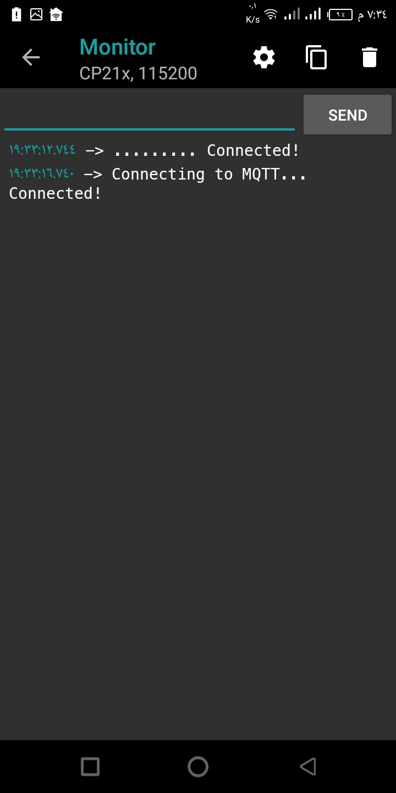
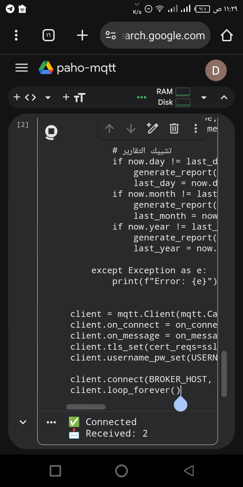

# Soil Moisture Monitoring System

MQTT-based system for real-time soil moisture monitoring with Telegram alerts and automated PDF reports.

## Features
- Connects to MQTT broker to receive sensor data
- Generates daily, monthly, and yearly reports with graphs
- Sends alerts and reports directly to Telegram
- Secure: Uses environment variables for credentials
- Logging for easy debugging

## Setup

1. **Clone the repo**
https://github.com/DoniaA7m9d/Soil-moisture-paho-mqtt.git

2. **Create .env file**
   Copy `.env.example` to `.env` and fill in your credentials:

3. **Install dependencies**
       pip install -r requirements.txt
4. **Run the system**
       python main.py
   
## Tech Stack
- Python 3.9+
- Paho MQTT
- ReportLab
- Matplotlib
- Python-dotenv

## Screenshot
**Serial Monitor Output:**  

**Generated Graph from Colab:**  

---
*Built for portfolio and LinkedIn showcase*
